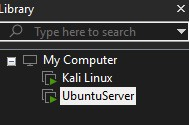
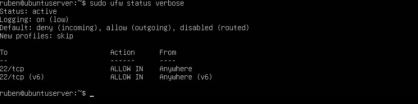
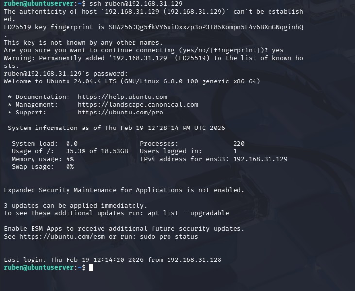
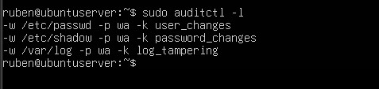

# Week 1: Home Lab Setup & Linux Hardening

**MSCS Course Mapping:** SE6001 — Computer Security (access controls, OS security)

## Objective

Build a virtualized cybersecurity lab environment and harden the Ubuntu Server following security best practices. This lab serves as the foundation for all subsequent projects in the portfolio.

## Lab Architecture

```
┌──────────────────────────────────────────────┐
│            Host Machine (Windows)             │
│               30GB RAM                        │
│          VMware Workstation Pro               │
│                                               │
│   ┌─────────────┐      ┌─────────────┐       │
│   │  Kali Linux  │      │Ubuntu Server │       │
│   │  Attack VM   │ NAT  │  Target VM   │       │
│   │  4GB RAM     │◄────►│  4GB RAM     │       │
│   │  2 CPUs      │      │  2 CPUs      │       │
│   │  40GB Disk   │      │  30GB Disk   │       │
│   └─────────────┘      └─────────────┘       │
│         │                      │              │
│         └──────┬───────────────┘              │
│                │                              │
│          NAT Network                          │
│        192.168.31.0/24                        │
└──────────────────────────────────────────────┘
```

## Tools Used

- VMware Workstation Pro
- Kali Linux (latest)
- Ubuntu Server 24.04 LTS
- UFW (Uncomplicated Firewall)
- OpenSSH
- auditd

## Steps Performed

### 1. Virtual Machine Setup

Installed VMware Workstation Pro and created two virtual machines:

- **Kali Linux** — serves as the attack machine for offensive security exercises. Allocated 4GB RAM, 2 CPU cores, and 40GB disk.
- **Ubuntu Server** — serves as the target and defensive environment. Allocated 4GB RAM, 2 CPU cores, and 30GB disk. Installed without a GUI to simulate a production server.

Both VMs are connected via VMware's NAT network, allowing them to communicate with each other and access the internet.



### 2. Firewall Configuration (UFW)

Configured UFW on the Ubuntu Server with a deny-by-default policy. This follows the principle of least privilege — block everything, then only allow what is explicitly needed.

```bash
sudo ufw default deny incoming
sudo ufw default allow outgoing
sudo ufw allow ssh
sudo ufw enable
```

**Why this matters:** A default-deny firewall policy ensures that no unexpected services are exposed. Only SSH (port 22) is allowed inbound, which is the minimum needed for remote administration.



### 3. SSH Key Authentication

Generated an Ed25519 SSH key pair on Kali and copied the public key to the Ubuntu Server. This enables passwordless, key-based authentication which is significantly more secure than password login.

```bash
# On Kali
ssh-keygen -t ed25519 -f ~/.ssh/id_ed25519
ssh-copy-id ruben@192.168.31.129

# Test connection
ssh ruben@192.168.31.129
```

**Why this matters:** SSH keys use asymmetric cryptography and are resistant to brute-force attacks. Password authentication is vulnerable to credential stuffing and dictionary attacks. In production environments, key-based auth is the standard.



### 4. System Auditing (auditd)

Installed and configured auditd to monitor critical system files. These audit rules will generate logs that feed into the SIEM deployment in Week 7.

```bash
sudo apt install auditd -y
sudo systemctl enable auditd
sudo systemctl start auditd
```

Configured the following audit rules:

```bash
sudo auditctl -w /etc/passwd -p wa -k user_changes
sudo auditctl -w /etc/shadow -p wa -k password_changes
sudo auditctl -w /var/log -p wa -k log_tampering
```

| Rule | Monitors | Why It Matters |
|------|----------|---------------|
| `/etc/passwd` | User account changes | Detects unauthorized user creation or modification |
| `/etc/shadow` | Password file changes | Detects password tampering or hash extraction attempts |
| `/var/log` | Log directory changes | Detects attackers trying to cover their tracks |

**Why this matters:** Auditing is the foundation of detection. Without logging, there is no visibility into what is happening on a system. These specific files are common targets during post-exploitation, making them high-value monitoring points.



## Key Takeaways

- A default-deny firewall policy is the first line of defense on any server
- SSH key authentication eliminates the risk of password-based brute force attacks
- System auditing provides the visibility needed to detect malicious activity
- Every hardening step follows the principle of least privilege: grant only the minimum access necessary

## Next Steps

Week 2 will build on this lab by configuring a virtual network between the VMs and performing packet capture and analysis with Wireshark.