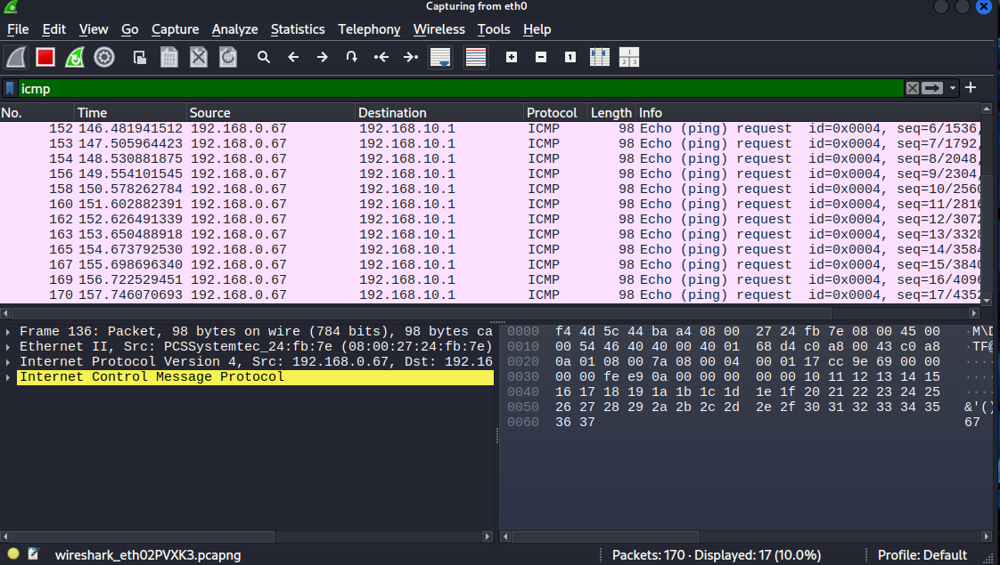
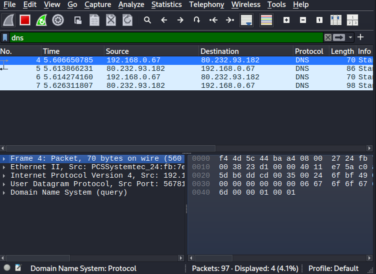
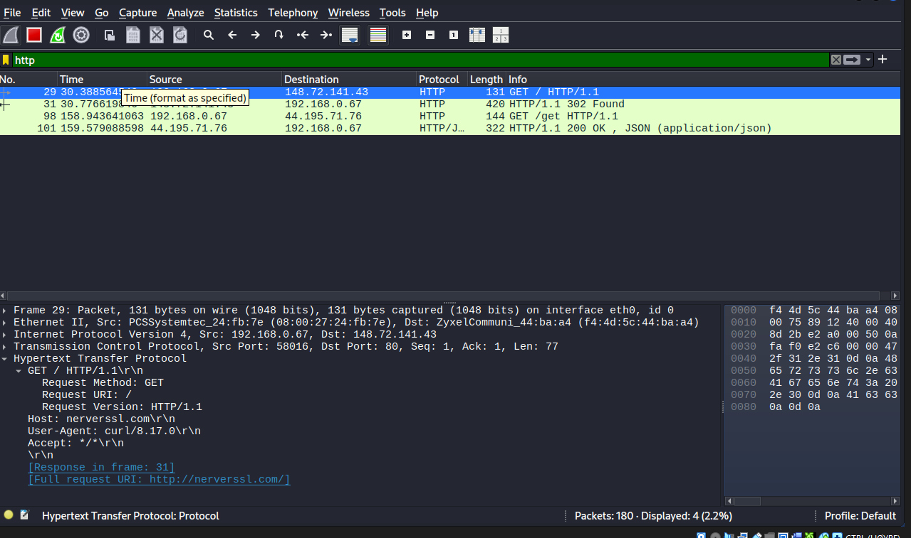
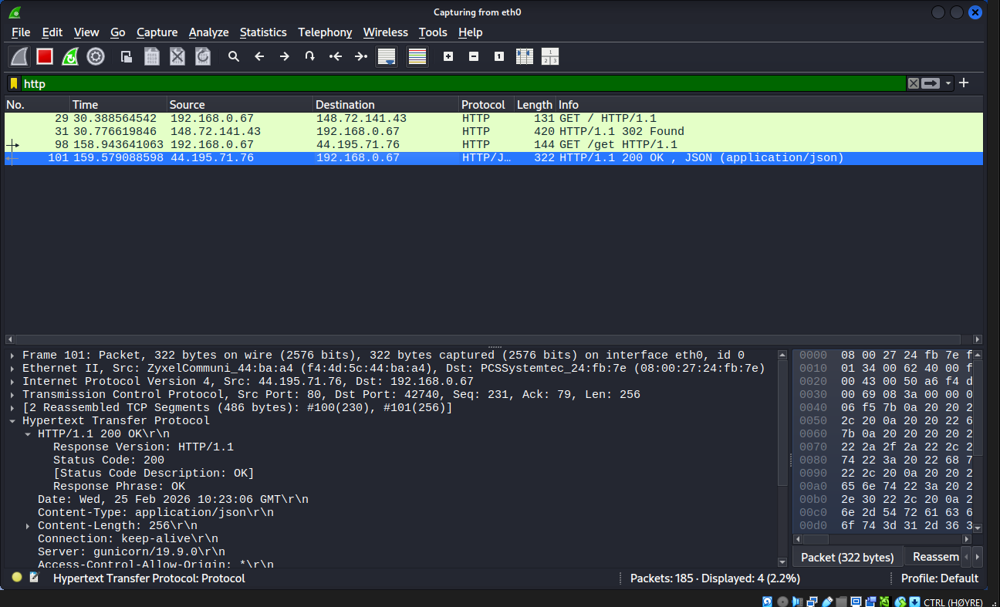
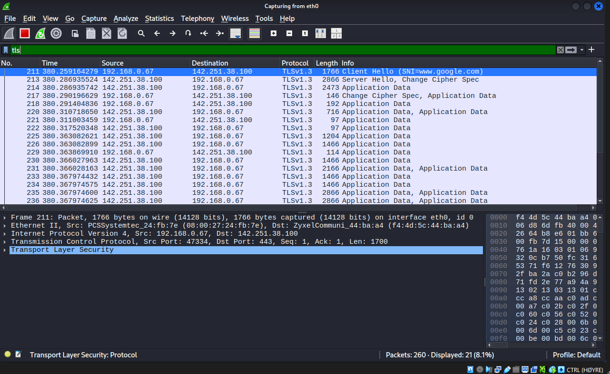
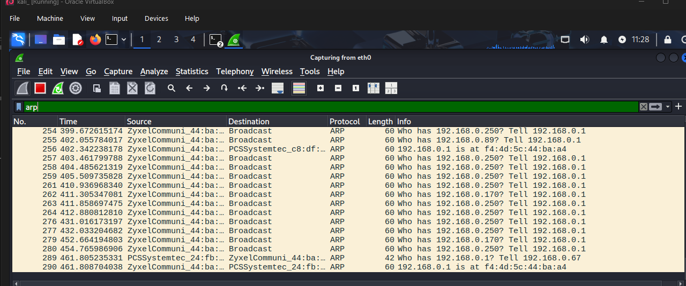
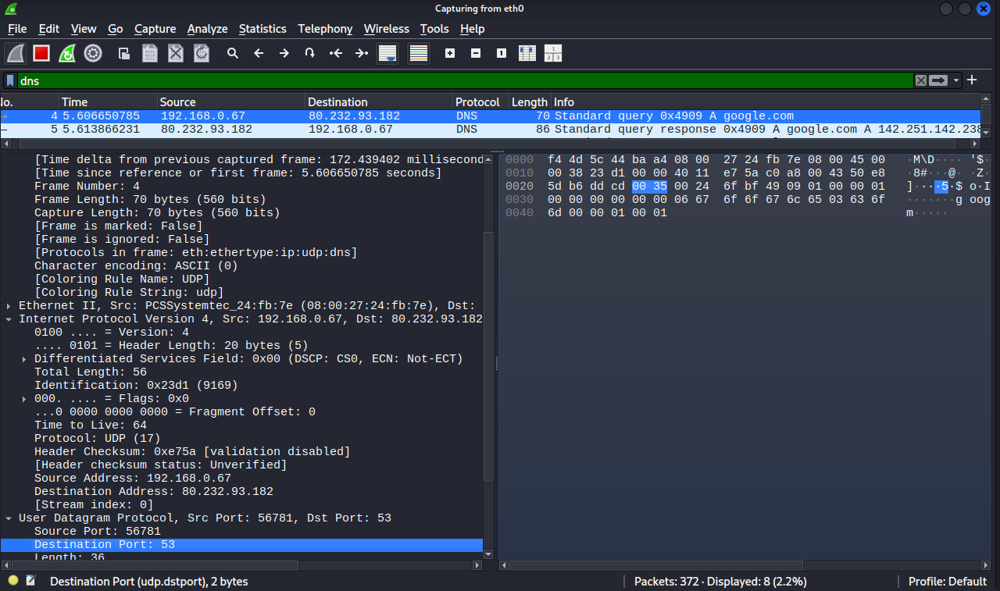

# Week 2: Networking Fundamentals & Packet Analysis

**MSCS Course Mapping:** SE6011 — Network Security

## Objective

Capture and analyze real network traffic using Wireshark to understand how common protocols operate at the packet level. This foundational knowledge is essential for threat detection, incident response, and network forensics.

## Tools Used

- Wireshark
- Kali Linux (capture machine)
- Ubuntu Server (target machine)
- Python3 HTTP server
- curl, ping, nslookup

## Captures & Analysis

### 1. ICMP (Ping)

Generated ICMP traffic by pinging the Ubuntu Server from Kali.

ICMP is the simplest network protocol to observe. Each ping sends an **Echo Request** from the source and expects an **Echo Reply** from the destination. The packet breakdown shows the full network stack in action: Ethernet frame (Layer 2) containing an IP packet (Layer 3) carrying the ICMP message.

**Security relevance:** ICMP can be used for network reconnaissance (ping sweeps to discover live hosts). Many firewalls block ICMP for this reason. Attackers can also use ICMP tunneling to exfiltrate data hidden inside ping packets.

### 2. DNS (Domain Name Resolution)

Generated DNS traffic using `nslookup google.com`.

DNS translates human-readable domain names into IP addresses. The capture shows a **Standard Query** from Kali to the DNS server on port 53, followed by a **Standard Query Response** containing the resolved IP address. All of this is visible in plaintext.

**Security relevance:** DNS traffic is unencrypted by default, meaning anyone on the network can see what domains a user is visiting. Attackers exploit this through DNS tunneling (hiding data exfiltration inside DNS queries) and DNS spoofing (returning fake IP addresses to redirect traffic). DNS monitoring is one of the most valuable data sources for threat detection in a SIEM.

### 3. HTTP — Request (GET)

Set up a Python HTTP server on Ubuntu (`python3 -m http.server 8080`) and made a request from Kali using `curl http://UBUNTU_IP:8080`.

The capture shows a `GET / HTTP/1.1` request. Expanding the Hypertext Transfer Protocol section in Wireshark reveals the full HTTP headers in **plaintext** — the Host, User-Agent, and everything the client sent to the server is completely readable.

**Security relevance:** This demonstrates why HTTP is a security risk. Any data sent over HTTP — including credentials, session tokens, and personal information — can be intercepted by anyone with access to the network.

### 4. HTTP — Response (200 OK)

The corresponding response from the Ubuntu Server shows `HTTP/1.0 200 OK` with the full response body in plaintext. The server's response headers and content are completely visible to anyone capturing traffic on the network.

**Security relevance:** This is the other half of the HTTP problem. Not only can attackers see what you're requesting, they can also see everything the server sends back. This is why HTTPS is mandatory for any site handling sensitive data.

### 5. TLS/HTTPS (Encrypted Traffic)

Generated HTTPS traffic using `curl https://www.google.com` and filtered for TLS.

The capture shows the **TLS handshake**: Client Hello, Server Hello, Certificate exchange, and then encrypted Application Data. Unlike the HTTP captures above, clicking on any Application Data packet reveals only encrypted bytes — the actual content is completely unreadable.

**Security relevance:** TLS solves the plaintext problem demonstrated in the HTTP captures. Even if an attacker is sniffing the network, they cannot read the encrypted content. The TLS handshake is visible (including the Server Name Indication, which reveals the domain), but the actual data exchanged is protected.

### 6. ARP (Address Resolution Protocol)

Captured ARP traffic by pinging the Ubuntu Server, which triggers ARP resolution.

ARP operates at Layer 2 and maps IP addresses to MAC addresses. The capture shows broadcast requests ("Who has 192.168.x.x? Tell 192.168.x.x") and unicast replies providing the MAC address. This happens automatically before any IP communication can take place.

**Security relevance:** ARP has no authentication mechanism. An attacker can send fake ARP replies to associate their MAC address with another host's IP address — this is called **ARP spoofing** or **ARP poisoning**. It enables man-in-the-middle attacks where the attacker intercepts all traffic between two hosts. This is why network segmentation and tools like Dynamic ARP Inspection exist.

## Additional HTTP Capture

Full Wireshark view of the HTTP session between Kali and the Ubuntu Python server, showing the complete request-response cycle with all packets visible.

## Key Takeaways

- Wireshark provides complete visibility into network traffic at every layer of the OSI model
- Unencrypted protocols (HTTP, DNS, ARP) expose data to anyone on the network — this is why encryption and network segmentation are critical
- TLS/HTTPS encrypts application data, making interception useless to attackers
- ARP has no built-in security, making Layer 2 attacks like ARP spoofing possible on local networks
- Understanding what normal traffic looks like is the foundation for identifying malicious activity

## Next Steps

Week 3 will build on this network knowledge by implementing cryptographic protocols (AES, RSA) in Python and inspecting the TLS handshake in greater detail.