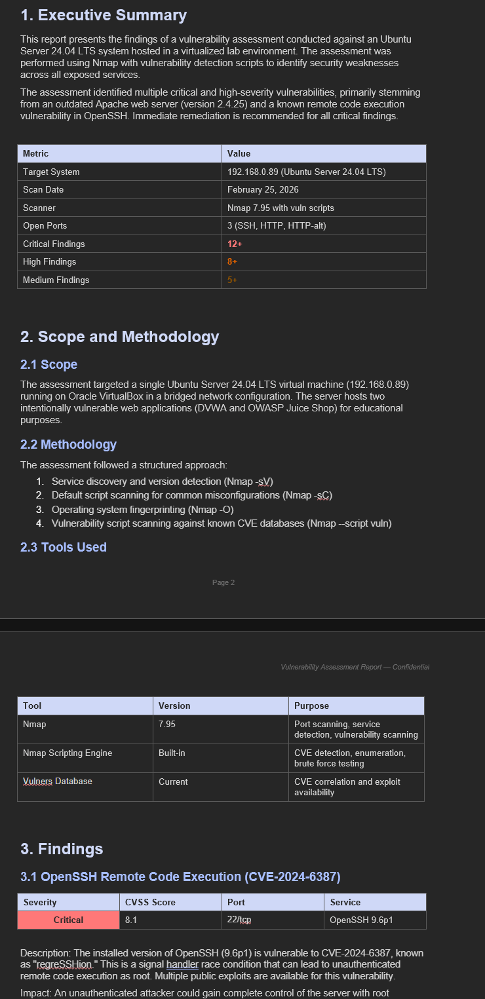

# Week 5: Vulnerability Scanning & Enumeration

**MSCS Course Mapping:** SE6002 — Application Security + SE6014 — Security Monitoring

## Objective

Perform a professional vulnerability assessment against the lab environment using industry-standard scanning tools. This week shifts from manual exploitation (Week 4) to systematic, automated vulnerability discovery — the approach used in real-world security engagements.

## Tools Used

- Nmap 7.95 with Nmap Scripting Engine (NSE)
- Vulners CVE database
- Kali Linux (scanning machine)
- Ubuntu Server 24.04 LTS (target)

## Lab Configuration

| Component | Details |
|-----------|---------|
| Target | 192.168.0.89 — Ubuntu Server 24.04 LTS on VirtualBox |
| Scanner | Kali Linux on same bridged network |
| Services running | OpenSSH 9.6p1, Apache 2.4.25 (DVWA), Juice Shop (port 3000) |

## Scanning Methodology

### Phase 1: Service Discovery and Version Detection

Initial scan to identify open ports, service versions, and operating system:

```bash
sudo nmap -sV -sC -O 192.168.0.89
```

This revealed three open ports (22, 80, 3000) with exact service versions — the foundation for CVE correlation.

### Phase 2: Vulnerability Scanning

Full vulnerability scan using Nmap's vuln scripts, which check each service against known CVE databases:

```bash
sudo nmap -sV -sC -O -A --script vuln 192.168.0.89 -oN vuln_scan.txt
```

The `--script vuln` flag runs all vulnerability detection scripts in Nmap's library, testing each discovered service against thousands of known vulnerabilities and returning matches with CVSS severity scores.

## Key Findings Summary

| Finding | Severity | CVSS | Port | Exploits Available |
|---------|----------|------|------|-------------------|
| OpenSSH RCE — CVE-2024-6387 (regreSSHion) | Critical | 8.1 | 22 | 40+ public exploits |
| Apache Multiple CVEs (2017–2025) | Critical | 9.8 | 80 | Dozens of public exploits |
| Missing HttpOnly Cookie Flag | Medium | — | 80 | Enables XSS cookie theft |
| Directory Listing / Info Disclosure | Medium | — | 80 | Exposes config, docs, .gitignore |
| CORS Wildcard Misconfiguration | Medium | — | 3000 | Enables cross-origin attacks |

### Critical: OpenSSH CVE-2024-6387 (regreSSHion)

A signal handler race condition in OpenSSH that allows unauthenticated remote code execution as root. Over 40 public exploits exist on GitHub. This is the highest-impact finding because it requires no authentication and grants root access.

### Critical: Apache 2.4.25 — Severely Outdated

Apache 2.4.25 was released in 2017 and has accumulated dozens of critical CVEs over eight years of missed patches. Key vulnerabilities include remote code execution (CVE-2021-44790), HTTP request smuggling (CVE-2023-25690), SSRF (CVE-2021-40438), and privilege escalation (CVE-2019-0211). This demonstrates why patch management is one of the most important security controls.

### Medium: Missing HttpOnly Flag

The PHPSESSID cookie lacks the HttpOnly flag, allowing JavaScript to read session cookies. Combined with the XSS vulnerabilities confirmed in Week 4, this enables full session hijacking.

### Medium: Information Disclosure

Nmap's http-enum script found browsable directories (/config/, /docs/, /external/), an exposed .gitignore file, and robots.txt — all providing attackers with valuable reconnaissance data about the application structure.

### Medium: CORS Misconfiguration

Juice Shop returns `Access-Control-Allow-Origin: *`, allowing any external website to make authenticated requests to the application on behalf of logged-in users.

## Deliverables

- **[Vulnerability Assessment Report](report.pdf)** — Professional report with executive summary, detailed findings, CVSS scores, and prioritized remediation recommendations
- **[Raw Scan Output](vuln_scan.pdf)** — Complete Nmap vulnerability scan results


### Report Preview



## How This Connects to Previous Weeks

This week ties together concepts from every previous week:

- **Week 1 (Hardening)** — The firewall we configured is why 997 ports showed as "filtered" rather than exposing additional attack surface. The auditd rules monitoring /etc/shadow are directly relevant because the OpenSSH vulnerability could grant root access to that file.
- **Week 2 (Packet Analysis)** — Understanding protocols at the packet level is what allows us to interpret scanner output and understand how each vulnerability would be exploited on the wire.
- **Week 3 (Cryptography)** — The TLS handshake knowledge explains why HTTPS traffic is protected while the HTTP services on ports 80 and 3000 expose everything in plaintext.
- **Week 4 (Web Vulnerabilities)** — The missing HttpOnly flag finding directly enables the XSS session hijacking attack we demonstrated. The SQL injection we exploited would also appear as a finding in a full web application scan.

## Key Takeaways

- Automated vulnerability scanning is essential because manual testing cannot scale to check thousands of CVEs across all services
- Outdated software is the single biggest source of exploitable vulnerabilities — Apache 2.4.25 alone had dozens of critical CVEs
- Version detection is the foundation of vulnerability assessment — knowing the exact software version enables precise CVE correlation
- A professional vulnerability assessment report translates technical findings into actionable remediation priorities
- Defense in depth matters — even with a critical SSH vulnerability, the firewall limiting exposed ports reduces overall attack surface

## Next Steps

Week 6 will apply offensive penetration testing methodology against HackTheBox machines, following the structured approach of reconnaissance, scanning, exploitation, and post-exploitation.
