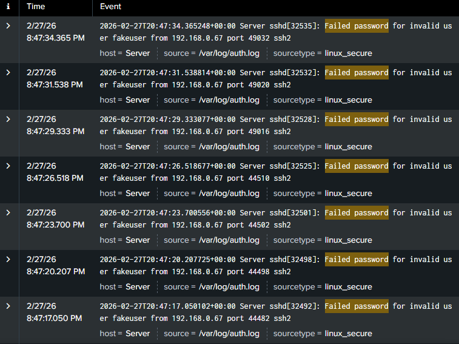

# Week 7: SIEM & Log Analysis

**MSCS Course Mapping:** SE6014 — Security Monitoring & Threat Detection

## Objective

Deploy a Security Information and Event Management (SIEM) system, ingest real system logs, create detection rules for common attacks, and build a security monitoring dashboard. This is the defensive counterpart to the offensive techniques practiced in Weeks 4-6.

## Tools Used

- Splunk Enterprise (Free License)
- Ubuntu Server 24.04 LTS (SIEM host)
- Kali Linux (attack traffic generator)
- auditd (system auditing from Week 1)

## What is a SIEM?

A SIEM collects logs from across an organization — servers, firewalls, applications, endpoints — and centralizes them in one place for searching, correlation, and alerting. It's the core tool of a Security Operations Center (SOC). Without a SIEM, security events are scattered across individual systems and nearly impossible to monitor at scale.

## Setup

### Splunk Installation

Deployed Splunk Enterprise on the Ubuntu Server and configured it to listen on port 8000 for web access.

```bash
sudo dpkg -i splunk.deb
sudo /opt/splunk/bin/splunk start --accept-license
sudo ufw allow 8000
```

### Log Sources

Configured Splunk to monitor three critical log files:

| Log Source | Path | What It Captures |
|-----------|------|-----------------|
| Authentication Log | `/var/log/auth.log` | SSH logins, failed attempts, sudo usage |
| System Log | `/var/log/syslog` | General system events, service starts/stops |
| Audit Log | `/var/log/audit/audit.log` | File access monitoring from auditd rules (Week 1) |

These log sources were added via **Settings → Add Data → Monitor → Files & Directories** in the Splunk web interface.

## Splunk Search Language (SPL) Fundamentals

SPL works like a pipeline — start with a search, then pipe results through commands:

**Basic text search** — find all events containing specific text:
```
index=main "Failed password"
```

**Boolean operators** — combine search terms:
```
index=main "Failed password" OR "sudo"
```

**Field extraction with rex** — pull structured data from raw logs using patterns:
```
index=main "Failed password" | rex "from (?<attacker_ip>\d+\.\d+\.\d+\.\d+)"
```
This extracts the IP address after the word "from" and names it `attacker_ip`.

**Counting and grouping with stats** — aggregate results like a pivot table:
```
index=main "Failed password" | rex "from (?<attacker_ip>\d+\.\d+\.\d+\.\d+)" | stats count by attacker_ip
```

**Filtering with where** — only show results matching a condition:
```
... | stats count by attacker_ip | where count > 3
```

## Attack Simulation

Generated realistic attack traffic from Kali Linux to produce security events for detection:

**Brute force SSH attack** — 10 rapid failed login attempts from Kali (192.168.0.67) against the Ubuntu Server:
```bash
for i in {1..10}; do sshpass -p 'wrongpassword' ssh -o StrictHostKeyChecking=no fakeuser@192.168.0.89; done
```

Each attempt generated a log entry in `/var/log/auth.log`:
```
Failed password for invalid user fakeuser from 192.168.0.67 port 49032 ssh2
```

Splunk ingested these events in real time, making them immediately searchable and visible in the dashboard.



## Detection Rules

### Brute Force Detection Alert

Created a scheduled alert to detect potential brute force attacks by identifying IP addresses with more than 3 failed login attempts:

**Search query:**
```
index=main "Failed password" | rex "from (?<attacker_ip>\d+\.\d+\.\d+\.\d+)" | stats count by attacker_ip | where count > 3
```

**Alert configuration:**
- Runs every hour
- Triggers when the number of results is greater than 0
- Expires after 24 hours

This detection rule would catch the brute force attack from Kali, which generated 9 failed attempts from a single IP — well above the threshold of 3.


## Security Monitoring Dashboard

Built a centralized dashboard with four panels providing real-time visibility into security events:

| Panel | Search Query | Purpose |
|-------|-------------|---------|
| Failed SSH Logins | `index=main "Failed password" \| stats count` | Total failed authentication attempts — a spike indicates a potential brute force attack |
| Failed Logins by IP | `index=main "Failed password" \| rex "from (?<attacker_ip>\d+\.\d+\.\d+\.\d+)" \| stats count by attacker_ip` | Identifies which IP addresses are generating failed logins — the attacker's source |
| Successful Logins | `index=main "Accepted" \| stats count` | Tracks legitimate access — a successful login after many failures may indicate a compromised account |
| Sudo Commands | `index=main "sudo" \| stats count` | Monitors privilege escalation — unexpected sudo usage could indicate an attacker has gained access and is escalating privileges |

Dashboard results during the simulation:
- **9 failed SSH logins** from Kali (192.168.0.67)
- **1 successful login** (legitimate SSH session)
- **156 sudo commands** (normal system administration activity)


## How This Connects to Previous Weeks

The SIEM deployment ties together concepts from across the program:

- **Week 1 (Hardening)** — The auditd rules monitoring `/etc/passwd`, `/etc/shadow`, and `/var/log` now feed directly into Splunk, providing visibility into the exact files attackers target during post-exploitation
- **Week 2 (Packet Analysis)** — Understanding protocols at the packet level helps interpret what the logs are showing — each failed SSH login is the result of a TCP connection, authentication attempt, and rejection
- **Week 4 (Web Vulnerabilities)** — The SQL injection and XSS attacks from DVWA would generate Apache access logs that Splunk could ingest and alert on
- **Week 5 (Vulnerability Scanning)** — The Nmap scans generated network traffic that would appear in firewall and IDS logs, detectable by a SIEM
- **Week 6 (Penetration Testing)** — Every attack technique used on HTB machines (brute force, default credentials, service exploitation) generates log entries that a properly configured SIEM can detect

## Key Takeaways

- A SIEM is the central nervous system of security monitoring — without it, attacks go undetected
- Log ingestion from critical sources (authentication, system, audit) provides the visibility needed to detect threats
- SPL follows a pipeline model: search → extract → aggregate → filter — building complex detections from simple building blocks
- Detection rules should focus on behavioral patterns (multiple failed logins from one IP) rather than single events
- Dashboards provide at-a-glance situational awareness — a SOC analyst monitors these continuously during their shift
- The gap between attack and detection is what security monitoring aims to minimize — the faster you detect, the less damage an attacker can do

## Next Steps

Week 8 will simulate a full breach scenario in the lab, detect it using this SIEM deployment, and produce an incident response report following the NIST SP 800-61 framework.
