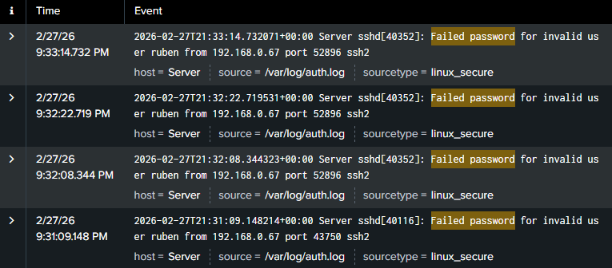
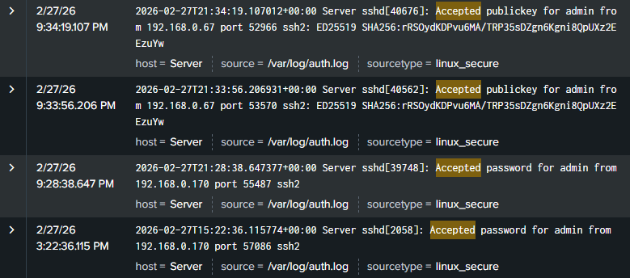
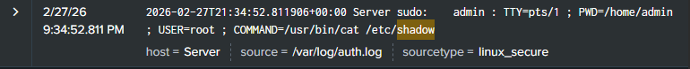

# Week 8: Incident Response Simulation

**MSCS Course Mapping:** SE6014 — Security Monitoring + SE6016 — Forensics

## Objective

Simulate a realistic breach scenario in the lab environment, detect it using the Splunk SIEM deployed in Week 7, and produce a professional incident response report following the NIST SP 800-61 Rev. 2 framework.

## Tools Used

- Splunk Enterprise (SIEM from Week 7)
- Kali Linux (attacker)
- Ubuntu Server 24.04 LTS (target)
- sshpass (brute force simulation)
- auditd (file access monitoring)

## NIST SP 800-61 Framework

The National Institute of Standards and Technology (NIST) Special Publication 800-61 defines four phases for handling security incidents:

1. **Preparation** — tools, processes, and people ready before an incident occurs
2. **Detection and Analysis** — identifying that an incident has occurred and understanding its scope
3. **Containment, Eradication, and Recovery** — stopping the attack, removing the threat, and restoring operations
4. **Post-Incident Activity** — lessons learned and improvements to prevent recurrence

This framework is the industry standard used by SOC teams, incident responders, and security consultants worldwide.

## Attack Simulation

### Attack Chain

Simulated a multi-phase attack from Kali Linux (192.168.0.67) against the Ubuntu Server (192.168.0.89):

**Phase 1 — Reconnaissance:**
```bash
nmap -sV -sC 192.168.0.89
```
Identified open ports and services, including SSH on port 22.

**Phase 2 — Brute Force:**
```bash
for i in {1..20}; do sshpass -p 'wrongpass' ssh -o StrictHostKeyChecking=no ruben@192.168.0.89; done
```
Generated 20 rapid failed SSH login attempts to simulate an automated brute force attack.

**Phase 3 — Access:**
```bash
ssh ruben@192.168.0.89
```
Successfully logged in, simulating that the attacker obtained valid credentials.

**Phase 4 — Post-Exploitation:**
```bash
whoami
cat /etc/passwd
sudo cat /etc/shadow
history
```
Simulated credential harvesting — enumerating user accounts and attempting to access password hashes.

## Detection in Splunk

### Failed Login Detection

The brute force attack generated multiple entries in `/var/log/auth.log`, each captured by Splunk in real time:

```
index=main "Failed password"
```

Each log entry showed the source IP (192.168.0.67), the targeted username (ruben), and the timestamp — revealing a clear automated brute force pattern with attempts occurring every few seconds.



### Successful Login Detection

After the brute force phase, Splunk captured successful logins from the same attacker IP:

```
index=main "Accepted"
```

The logs show both publickey and password-based accepted logins from 192.168.0.67. A successful login from an IP that was previously generating failed attempts is a strong indicator of account compromise.



### Credential Harvesting Detection

Splunk captured the attacker's attempt to read the shadow file using sudo, revealing post-exploitation credential harvesting activity:

```
index=main "shadow"
```

The log shows the exact command executed (`COMMAND=/usr/bin/cat /etc/shadow`), the user who ran it (admin), and that it was executed as root — providing a complete audit trail of the attacker's actions.



### Audit Log Detection

The auditd rules configured in Week 1 generated detailed events in `/var/log/audit/audit.log`, providing an additional layer of visibility into system-level activity during the attack:

```
index=main source="/var/log/audit/audit.log"
```

These logs captured service activity, credential operations, and session events — confirming that the auditing infrastructure is functioning as intended and feeding into the SIEM.


### Security Dashboard

The security monitoring dashboard showed the attack activity across all four panels — elevated failed login count, the attacker IP identified, successful logins, and sudo command activity from the post-exploitation phase.


### Brute Force Alert

The Splunk brute force detection alert configured in Week 7 identified the attacking IP after it exceeded the threshold of 3 failed login attempts:

```
index=main "Failed password" | rex "from (?<attacker_ip>\d+\.\d+\.\d+\.\d+)" | stats count by attacker_ip | where count > 3
```


## Deliverables

- **[Incident Response Report](incident_response_report.docx)** — Professional report following NIST SP 800-61 with incident summary, detection timeline, IOCs, containment actions, and lessons learned

## How the Attack Chain Maps to Detection

| Attack Phase | Attacker Action | Log Source | Splunk Detection |
|-------------|----------------|-----------|-----------------|
| Reconnaissance | Nmap scan | syslog / firewall | Port scan pattern in network logs |
| Brute Force | Failed SSH logins | auth.log | Brute force alert triggered (>3 failures per IP) |
| Access | Successful SSH login | auth.log | "Accepted" event from previously attacking IP |
| Post-Exploitation | cat /etc/passwd | audit.log | Auditd rule on /etc/passwd triggered |
| Post-Exploitation | sudo cat /etc/shadow | auth.log + audit.log | Sudo command logged with full command path |

## Key Takeaways

- Incident response is a structured process, not a panic reaction — the NIST framework provides a repeatable methodology for handling any security event
- Detection is only valuable if it leads to action — the SIEM detected the brute force but without automated blocking (fail2ban), the attack completed before manual intervention was possible
- Multiple log sources provide layered visibility — auth.log captured the authentication events, while audit.log recorded file access and system-level activity
- Post-incident analysis is as important as containment — identifying gaps (no rate limiting, password auth enabled, hourly alert schedule) leads to concrete improvements
- Defense in depth reduces impact — even though the attacker gained access, the firewall limited exposed services, and auditd provided visibility into post-exploitation activity
- Every incident should result in a stronger security posture — the lessons learned from this simulation directly improve the lab's defenses

## Phase 2 Complete

With Week 8 finished, Phase 2 of the program is complete. The deliverables produced are the artifacts hiring managers look for: a vulnerability assessment report (Week 5), CTF writeups (Week 6), a working SIEM with custom dashboards (Week 7), and a complete incident response report (Week 8).

## Next Steps

Week 9 begins Phase 3 — Specialization. The focus shifts to malware analysis, setting up an isolated analysis environment and performing static and dynamic analysis on real malware samples.